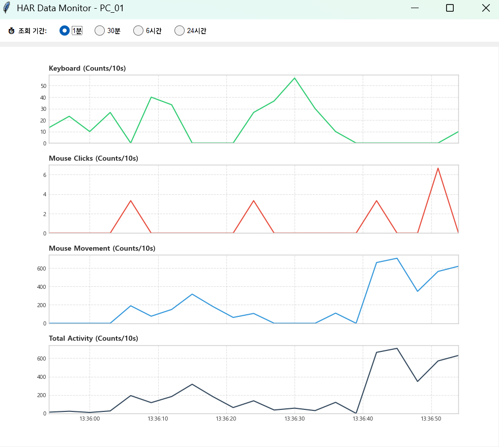

# 🟦 KM-TRACK

[](README.ko.md)
  



**K**eyboard & **M**ouse **T**race for **R**ecognition of **A**ctivity **C**omputing **K**ernel

**KM-TRACK** is a tool designed to build **Human Activity Recognition (HAR)** research datasets by collecting and monitoring keyboard and mouse usage in real-time. It runs in the background to capture user input events and provides a real-time visualization dashboard.

---

## 📥 1. Download & Installation

Click the link below to download the latest installer (`KM_TRACK_Setup.exe`).

👉 **[Download Latest Version (Click Here)](https://github.com/janghyunroh/KM-TRACK/releases/latest/download/KM_TRACK_Setup.exe)**

> **Note:** If a Windows security warning (SmartScreen) appears, click **'More Info' -> 'Run anyway'**. (This occurs because the installer is not signed by a commercial certificate.)

---

## ✨ 2. Key Features

- **Auto-Capture:** Automatically starts on PC boot and collects data in the background.
- **Real-time Monitoring:** View activity graphs in real-time via the system tray icon.
- **Data Efficiency:** Optimizes storage by treating idle time as '0' when no events occur.
- **Personalization:** Distinguishes data by setting a Participant ID during installation.
- **Safe Data Retention:** Collected data files are preserved even if the program is uninstalled.

---

## 🚀 3. Usage

### 1. Initial Setup

1. The program runs automatically after installation.
2. When the **PC Identification Name** window appears, enter your assigned ID (e.g., `User_01`, `Participant_A`).

### 2. Verification

- If you see the **blue square icon (🟦)** in the system tray (bottom right), it is working correctly.
- **Right-click** the icon to see the menu:
  - **Open Monitoring:** Opens the real-time graph dashboard.
  - **Exit:** Stops data collection and closes the program.

### 3. Graph Dashboard

- View activity changes in **1m / 30m / 6h / 24h** intervals.
- The Y-axis values are normalized to **Average events per 10 seconds (Counts/10s)**.

---

## 📊 4. Data Format

Data is saved as CSV files in the `Documents > HAR_Data` folder (or the `Data` subfolder in the installation directory).  
Example filename: `2026-02-12_User_01.csv`

| Column                | Description                                                 |
| :-------------------- | :---------------------------------------------------------- |
| **Timestamp**         | Record time (YYYY-MM-DD HH:MM:SS)                           |
| **Keyboard_Count**    | Total keyboard strokes over a 3-second window               |
| **Mouse_Click_Count** | Total mouse clicks over a 3-second window                   |
| **Mouse_Move_Count**  | Total mouse movement events detected over a 3-second window |

---

## 🛠️ Development Setup (For Developers)

To modify or build this software, follow the steps below.

#### 1. Clone the Repository

```bash
git clone [https://github.com/janghyunroh/KM-TRACK.git](https://github.com/janghyunroh/KM-TRACK.git)

```

#### 2. Install Dependencies

```bash
pip install -r requirements.txt

```

#### 3. Run

```bash
python sensor_gui.py

```

#### 4. Build EXE (Requires PyInstaller)

```bash
python -m PyInstaller --noconsole --onefile --hidden-import=pynput --hidden-import=pystray --hidden-import=matplotlib --hidden-import=matplotlib.backends.backend_tkagg --hidden-import=tkinter sensor_gui.py

```

To create an installer, download `Inno Setup`, modify the provided `.iss` script, and compile.

---

## 📝 License

This project is licensed under the MIT License - see the [LICENSE](./LICENSE) file for details.

---
